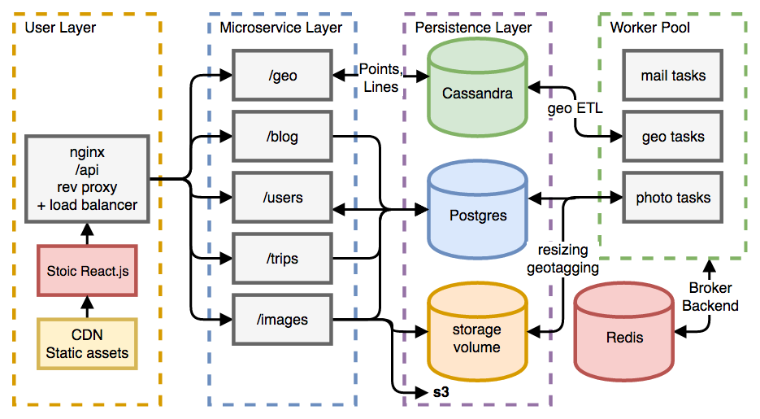

========
Master repo and composer for Stoic

The (over)Architecture so far
-----------------------------


Goals
-----

Stoic was built with the intention of exploring microservice architecture
design and management. The primay goal is to have highly encapsulated services
that may be developed, tested, deployed, and scaled as needed.
Another area of exploration is in continous deployment of the individual
services. Each service is individually tested (unit tests + travis) and 
containerized (docker) which is enough to have some continuous deployment,
though perhaps not sufficient enough for real world use as it's still lacking
functional and integration tests (TODO?).

Running
-------

Install Docker and Docker Compose then run:

```
docker-compose build
docker-compose up
```

Environment Flags
-----------------

There are a handful of environment variables to be configured.
Some of the most helpful for debugging are:
`FLASK_DEBUG` - Set to `1` for debug logging from Flask

`SSL_DISABLE` - Set to `True` to disable SSL when developing or debugging

Buzzword Checklist
------------------
- [ ] Agile
- [ ] AI
- [ ] Augmented reality
- [x] Automated
- [ ] Blockchain
- [x] Cloud
- [x] Concurrent
- [x] Containerized
- [x] Continous integration/continuous delivery
- [x] Distributed
- [x] Data driven
- [x] Data visualization
- [x] ETL
- [ ] Framework
- [ ] Internet of things
- [x] NoSQL
- [x] Microservice
- [x] Mobile 
- [x] REST
- [x] Responsive
- [x] Scalable
- [x] Test driven development
- [x] Web app
